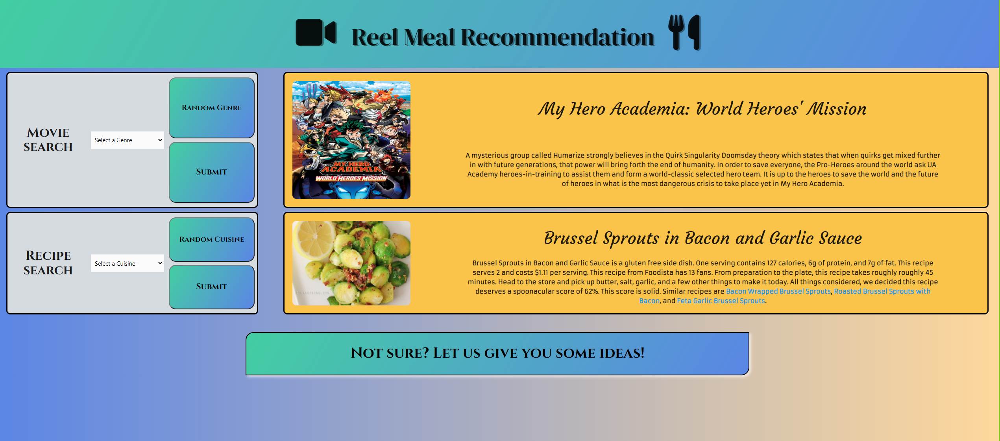

# "Reel Meal" webpage

## Description 

 ### Overview  

    Our application is intended to help a user quickly plan
    anevening by giving them a movie and meal recipe option
    based on either criteria that the user gives, in the form of a
    single dropdown menu for each search, or by simply having the webpage
    randomly obtain an option from one or both search values. 

### User Story 

    AS a user of the webpage
    I WANT to get a movie and meal recipe option
    SO THAT I can quickly plan out an evening without browsing various options

### Acceptance Criteria 

    GIVEN I open the wepage
    WHEN I select the movie dropdown box
    THEN I see a list of lsited movie genres to select from
    WHEN I hit submit
    THEN a movie result is returned and shown in the result box
    WHEN I select the food drop down box
    THEN I see a list of listedcuisines to choose from
    WHEN I hit submit
    THEN a meal recipe from the cuisine of my choice is shown

    -ALTERNATIVELY-
    WHEN I hit the random button on the movie search box
    THEN a random movie from any of the listed genres is displayed
    WHEN I hit the random button on the meal recipe search box
    THEN a random meal recipe from any of the listed cuisines is displayed

    -ALTERNATIVELY-
    WHEN I hit the button at the bottom of the page
    THEN a random option for both the movie and meal is displayed from the listed
      genres and cuisines, respectively.

## Technologies Used 

    For our data retrieval, we have used the Spoonacular API for
    our recipes, and the [MOVIE API] to retrieve our movie options.
    We also used the CSS framework Materialize, jQuery, and google fonts.

## Future Project Direction and Development

    To build on this project in the future, we could have the movie 
    search box display multiple movie results at a time. In addition,
    we would probably give a link to the user, to open a movie 
    search option within the movie streaming service for that movie,
    such as Netflix or Disney+ . 
    
    To develop the recipe search options, future development could include
    deisplaying multiple recipe options at once, as well as giving the user a list
    of ingredients for those recipe options. A further step may be to give the
    user store locations where those ingredients could be purchased. Alternatively,
    the recipe results could be replaced with meal results from local restaurants, and
    the user could then be provided a link to order those options with a meal delivery
    service like DoorDash. 

## Link to Deployed Application and GitHub repository

    https://njscc.github.io/group_project_one/ 

    https://github.com/NJscc/group_project_one
    
 ## Screenshot  

    Image of webpage on page load.

    

    Image of webpage after user input.

    